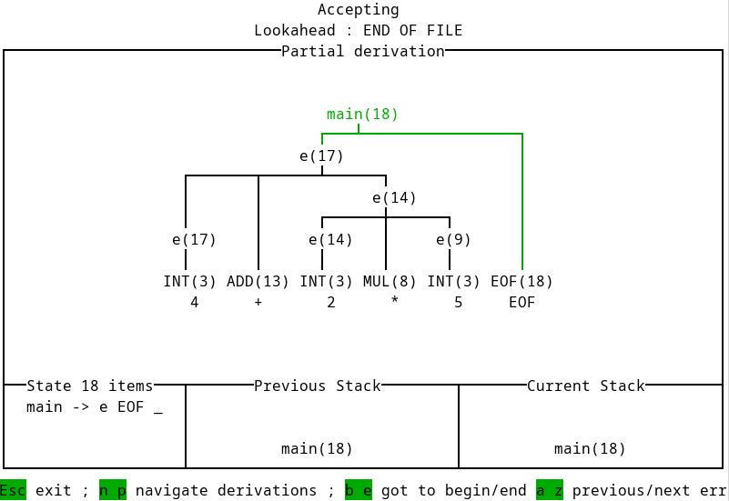

# Cairn - A derivation explorer and logger for Menhir parser

Cairn is a small library that can be used conjointly with the Menhir parser generator.
Its goal is to provide a step-by-step logger to the execution of the LR1 automaton on its input, in order to visualize the sequence of partial derivations produced (until the final derivation).
Its goal is to be a teaching (or self-teaching) tool of the behavior of LR1 parser.

It can either log its result as log files, or launch a small terminal explorer of the derivation (in utf8), made with lambda-term.

It is not made to be executed or very long inputs, as the trees would be too large to be properly displayed (and understood); besides, the tool stores every step of the execution of the parser, so a long execution would probably be heavy in memory. However, it has been tested on inputs of around several hundreds of tokens without memory issues or slowdown.

## Install

### On Opam

- `opam install cairn`

### From source - globally

- `dune build`
- `dune install`

This will install it in your current opam installation. You might then use the `cairn` library in your projects.

### From source - locally

Simply copy `src` directory to your project and add the library `cairn` where you want to use it.

## Usage

### Minimal setup example

We suppose you have an existing Menhir grammar along with an accompanying Lexer, i.e. a folder containing `<Lexer>.mll` and `<Parser>.mly`. See for example the grammar located in folder [example/eee](example/eee) of the present project. The minimal way to invoke Cairn is performed through the following steps, where elements in `<>` should be adapted to your case:

- Run Ocamllex to get the module `<Lexer>` (`ocamllex <Lexer>.mll`).
- Run Menhir with options `--table --inspection --cmly` to get the module `<Parser>` and the file `<Parser>.cmly` (`menhir --table --inspection --cmly <Parser>.mly`). (It is possible (and better) to automate these two steps in a dune file).
- Create the two following modules (`Grammar_eee` is the decoding of the cmly file, `Eee_parser` is the module created by Cairn):

```OCaml
module Grammar_eee = MenhirSdk.Cmly_read.Read (struct
  let filename = "<Parser>.cmly"
end)

module Eee_parser =
  Cairn.Parsing.MakeWithDefaultMessage
    (struct
      type value_parsed = <type_returned_by_<Parser>.main>
    end)
    (<Parser>)
    (<Lexer>)
    (Grammar_eee)
```

- You can now parse a string with the function `Eee_parser.parse_string`, e.g., `let res = Eee_parser.parse_string "4+2*5"` will display the UI shown below (that can be navigated), and after closing the UI, the result will be stored in `res` (here, `unit`).

This example is implemented in [example/minimal.ml](example/minimal.ml). You can run this example directly from Cairn folder with command `dune exec -- example/minimal.exe "4+2*5"`.



### Other usage examples

Here we will describe variations to the minimal example above. Most of the features described here are illustrated in [example/visualiser.ml](example/visualiser.ml). This example can be run from Cairn folder with `dune exec -- visualiser.exe` (it will display a helper message).

Consult as well the documentation in [src/Parsing.mli](src/Parsing.mli) and [src/ParserLog.mli](src/ParserLog.mli) for further details.

- For the cmly file, it might not be desirable to use its direct name (especially if the executable is destined to be installed or executed from somewhere else than its own directory).
In that case, it is worth to bundle it in the executable with, for
example, ocaml-crunch (see [example/linear/dune](example/linear/dune) to see how). It is then needed
to use the `FromString` functor of `MenhirSdk.Cmly_read` rather than the
`Read` one as follows:

```OCaml
module Grammar = MenhirSdk.Cmly_read.FromString (struct
  let content = Option.get (<Module_generated_by_ocaml_crunch>.read "<name_of_cmly_file>")
end)
```

- In addition to the `parse_string` function illustrated above, the module generated by Cairn also provide the following functions:
  - `parse_file` that treats its argument as the name of a file to be parsed.
  - `parse` that requires the text to parse and the lexer buffer (of type `Lexing.lexbuf`).

  These functions have the same behavior as `parse_string`, and admit optional arguments to control the error strategy used (see below), and whether the derivation is shown in a UI (as shown above) and/or logged in a file.

  There is a last function provided, `parse_to_derivation`, that instead of showing the log of the derivation, returns it to be manipulated in the code.

- A typical instantiation of the `Make` functor is similar to the minimal one, and should look like :

  ```OCaml
  module Grammar = MenhirSdk.Cmly_read.Read (struct let filename = "<Parser>.cmly" end)

  module P = Cairn.Parsing.Make (struct type value_parsed = <type_returned_by_<Parser>.main>) (<Parser>) (<Lexer>) (<ParserMessages>) (Grammar)
  ```

  To get the module `<ParserMessages>`, it is necessary to add the option `--compile-errors` to the invocation of Menhir.

- Cairn proposes an experimental (for now) support of error recovery mechanism. By default, on an error the parsing is stopped. If value `PopFirst` is provided as the optional argument `strategy` to a parsing function, in case of error, the stack will be popped until some terminal, or non-terminal with attribute `backtrack` is on the top (or the stack is empty), after what, tokens will be ignored until some can be shifted onto the stack. Then parsing is resumed.

- Cairn is able to use two attributes that you can add on the terminals and non-terminals in the Menhir file:

  - `short` that allows you to give a smaller or more explicit name to a terminal or non-terminal to improve the readability of the trees.
  - `backtrack` that is used by the naïve error mechanism recovery described above. When an error occurs, the parser pops the stack until an element with attributes backtrack is set, and then discards the inputs token until it can shift one when it resumes parsing.

- If you want to use a starting symbol that is not named `main`, you need to modify the `<Parser>.Incremental` module you use to invoke the `Make` functor. In case that starting symbol is named `foo`, you can achieve that by defining the following module:

  ```Ocaml
  module ParserFoo = struct
    include <Parser>
    module Incremental = struct
      let main = Incremental.foo
    end
  end
  ```

- If your Lexing function is not name `token`, but, e.g. `bar`, you need to pass the following module instead of `<Lexer>`:

  ```Ocaml
  module LexerBar = struct
    let token = <Lexer>.bar
  end
  ```

## Known limitation and issues

- Cairn has only been tested on Linux. Using it on other systems might fail.
- The error mechanism recovery (activated with value `PopFirst` for `error_strategy`) is very basic and might be useless as is. It might be improved in the future.
- The lookahead displays only the text parsed and not the corresponding token. That is due to a limitation in Menhir that does not allow to get the terminal corresponding to a token, and that only terminals can be converted to their names, and not tokens.
- The cmly handling is quite tricky as it must be generated by menhir, then used in the program at execution time. A way to properly deal with this is shown in the examples (with ocaml-crunch), but other solutions might exists. To my knowledge, it is not possible to generate the Grammar module directly with menhir invocation, which would be easier.

## Possible improvements

- Improving display (e.g. navigating stacks and state items, etc.).
- Showing LR1 objects instead of LR0 ones.
- Improving error mechanism and introducing other ones (limited by Menhir not allowing to get a terminal from its token).
- Others you might suggest.

## Authors

- Vincent Penelle, university of Bordeaux
